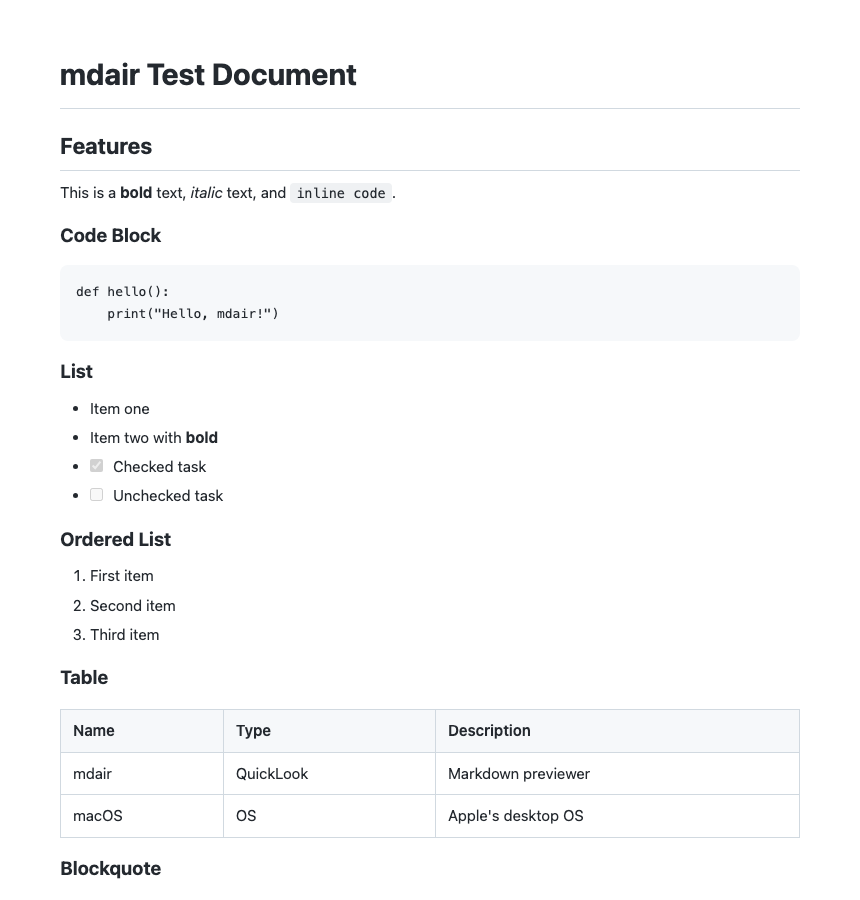

<p align="right">
  <a href="README.md">English</a> · <strong>Korean</strong>
</p>

# mdair — Markdown Air Previewer

<p align="center">
  
  <a href="https://github.com/tykimos/mdair/releases"></a>
  <a href="LICENSE"></a>
  
  
</p>

<p align="center">
  <strong>마크다운 파일에 숨결을 불어넣다 — Finder에서 바로 미리보기.</strong>
</p>

<p align="center">
  <a href="#기능">기능</a> · <a href="#설치">설치</a> · <a href="#소스에서-빌드">빌드</a> · <a href="#동작-원리">동작 원리</a> · <a href="#라이선스">라이선스</a>
</p>

---

<p align="center">
  <picture>
    <source media="(prefers-color-scheme: dark)" srcset="docs/assets/mdair-preview-dark.png">
    
  </picture>
</p>

**mdair**는 macOS에서 마크다운 파일의 네이티브 QuickLook 미리보기를 제공하는 경량 앱입니다. Finder에서 `.md` 파일을 선택하고 `Space`만 누르면 아름답게 렌더링된 미리보기를 바로 볼 수 있습니다.

## 기능

| 기능 | 설명 |
|------|------|
| **QuickLook 통합** | Finder에서 `Space`를 눌러 `.md` 파일 즉시 미리보기 |
| **독립 뷰어** | `.md` 파일을 더블클릭하거나 드래그하여 전용 창에서 열기 |
| **다크 모드** | 시스템 설정에 맞춰 자동으로 라이트/다크 테마 전환 |
| **풍부한 마크다운** | 제목, 목록, 표, 코드 블록, 인용문, 체크박스, 이미지, 링크 |
| **의존성 없음** | 순수 네이티브 macOS — Electron, Node.js, 외부 프레임워크 불필요 |
| **초경량** | 설치 용량 200KB 미만 |

## 설치

### 다운로드

[Releases](https://github.com/tykimos/mdair/releases) 페이지에서 최신 버전을 받으세요:

- **`mdair.pkg`** — 더블클릭으로 설치 (권장)
- **`mdair.dmg`** — 열어서 내부 PKG 인스톨러 실행

### Gatekeeper 우회

mdair는 Apple Developer ID로 서명되지 않았기 때문에 macOS에서 설치를 차단할 수 있습니다. 열기 방법:

1. `mdair.pkg`를 **우클릭** → **열기** 선택 → 대화상자에서 **열기** 클릭
2. 또는 **시스템 설정 → 개인정보 보호 및 보안** → 하단의 **확인 없이 열기** 클릭

### 설치 후

QuickLook 확장이 자동으로 활성화됩니다. Finder에서 아무 `.md` 파일을 선택하고 `Space`를 누르면 미리보기가 표시됩니다.

### macOS 설정

#### 클릭만으로 QuickLook 미리보기 활성화 (Finder 설정)

기본적으로 `Space`를 눌러야 QuickLook이 실행됩니다. 파일 선택 시 자동으로 미리보기를 표시하려면:

1. **Finder** → **설정** 열기 (또는 `⌘,` 누르기)
2. **일반** 탭으로 이동
3. **"Quick Look으로 미리보기 표시"** 체크 (macOS Ventura 이상)

또는 터미널에서 설정할 수 있습니다:

```bash
defaults write com.apple.finder QLEnableTextSelection -bool true
defaults write com.apple.finder QLInlinePreviewMinimumSupportedSize -int 0
killall Finder
```

#### mdair를 `.md` 파일 기본 앱으로 설정

모든 마크다운 파일을 mdair로 열려면:

1. Finder에서 아무 `.md` 파일을 **우클릭**
2. **정보 가져오기** 선택 (또는 `⌘I` 누르기)
3. **다음으로 열기** 항목에서 **mdair** 선택
4. **모두 변경...** 클릭 → **계속** 으로 확인

이제 모든 `.md` 파일이 mdair로 열립니다.

#### QuickLook 확장 활성화 확인

설치 후 QuickLook 미리보기가 작동하지 않는 경우:

1. **시스템 설정 → 확장 프로그램 → Quick Look** 이동
2. **QLMarkdownPreview**가 체크되어 있는지 확인
3. 표시되지 않으면 Finder를 재시작해 보세요:

```bash
killall Finder
```

## 소스에서 빌드

macOS 13.0 이상에서 Xcode Command Line Tools가 필요합니다.

```bash
# 앱 빌드
./scripts/build.sh

# 인스톨러 생성 (선택사항)
./scripts/create-pkg.sh
./scripts/create-dmg.sh
```

빌드된 앱은 `build/mdair.app`에 있습니다. `/Applications/`에 복사하면 수동 설치됩니다.

## 동작 원리

mdair는 두 가지 컴포넌트로 구성됩니다:

1. **mdair.app** — Cocoa + WebKit으로 만든 독립 마크다운 뷰어
2. **QLMarkdownPreview.appex** — 앱 내부에 번들된 QuickLook Preview Extension

마크다운-HTML 변환은 Objective-C와 Swift로 네이티브 구현되어 있어 외부 라이브러리가 필요 없습니다. CSS `prefers-color-scheme`을 활용해 macOS 라이트/다크 모드에 자동 대응합니다.

## 지원 형식

`.md` `.markdown` `.mdown` `.mkd` `.mkdn` `.mdwn` `.mdtxt` `.mdtext`

## 라이선스

[MIT](LICENSE) &copy; 2026 tykimos
