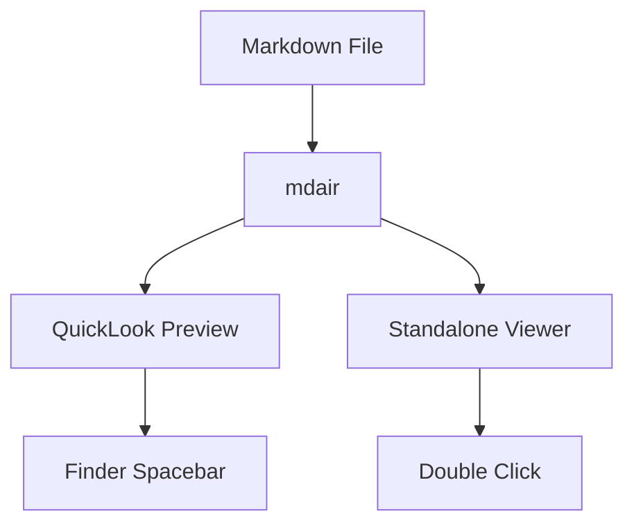

# mdair Test Document

## Features

This is a **bold** text, *italic* text, and `inline code`.

### Code Block

```python
def hello():
    print("Hello, mdair!")
```

### List

- Item one
- Item two with **bold**
- [x] Checked task
- [ ] Unchecked task

### Ordered List

1. First item
2. Second item
3. Third item

### Table

| Name | Type | Description |
|------|------|-------------|
| mdair | QuickLook | Markdown previewer |
| macOS | OS | Apple's desktop OS |

### Blockquote

> This is a blockquote.
> It can span multiple lines.

---

### Link & Image

[Visit GitHub](https://github.com)

That's it! ~~deleted text~~ and ***bold italic***.

### Mermaid Diagram


